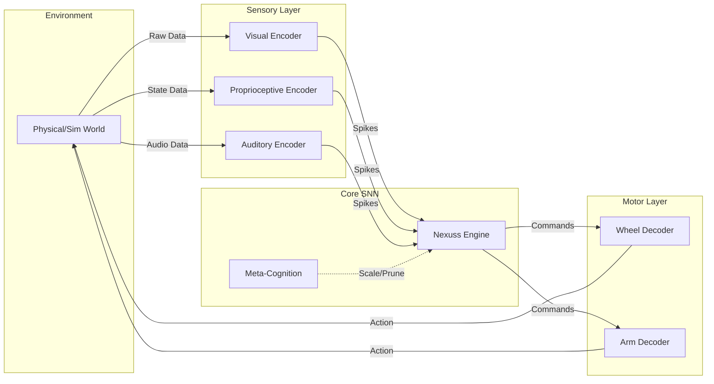

# Phase 2 Specification: Embodied Sensory Integration & Closed-Loop Control

**Project:** Nexuss Neural Cognition  
**Phase:** 2 of 3  
**Status:** DRAFT SPECIFICATION  
**Version:** 2.0.0-beta  

---

## 1. Executive Summary

Phase 2 transitions the Nexuss Neural Cognition engine from a standalone simulator to an **embodied cognitive system**. This phase focuses on closing the perception-action loop by integrating real-world sensory inputs (vision, proprioception, audition) and motor outputs. The core SNN will no longer run in isolation but will drive and be driven by a simulated or physical agent within an environment.

The primary goal is to demonstrate **autonomous sensorimotor coordination**, where the network learns to navigate, avoid obstacles, and manipulate objects through unsupervised STDP learning gated by environmental feedback.

---

## 2. Scope & Objectives

### 2.1 In Scope
- Development of **Sensory Encoder Modules** (Camera, IMU, Microphone).
- Development of **Motor Decoder Modules** (Wheel control, Arm actuation).
- Integration with **ROS 2** (Robot Operating System) for hardware abstraction.
- Implementation of a **Simulation Environment** (Gazebo/Webots) for safe testing.
- Closed-loop learning experiments (obstacle avoidance, target tracking).

### 2.2 Out of Scope
- High-level semantic reasoning (reserved for Phase 3).
- Long-term episodic memory consolidation (reserved for Phase 3).
- Distributed multi-node simulation (reserved for Phase 3).

### 2.3 Key Performance Indicators (KPIs)
| Metric | Target | Measurement Method |
| :--- | :--- | :--- |
| **Sensor Latency** | < 20ms (frame-to-spike) | Timestamp delta analysis |
| **Motor Latency** | < 15ms (spike-to-actuator) | Command issuance logging |
| **Loop Frequency** | ≥ 50Hz | Control loop timer |
| **Learning Speed** | Obstacle avoidance in < 5 mins | Task success rate over time |
| **Resource Overhead** | < 15% CPU increase vs. idle sim | `top`/`htop` monitoring |

---

## 3. Technical Architecture

### 3.1 System Diagram



### 3.2 Module Specifications

#### 3.2.1 Visual Encoder (Retina Model)
- **Input:** RGB Image (640x480 min).
- **Processing:** 
  - Convert to Grayscale -> Edge Detection (Sobel) -> Contrast Enhancement.
  - **Event-Based Conversion:** Use Difference-of-Logarithm (DoL) to generate spikes only on pixel changes (Dynamic Vision Sensor simulation).
- **Output:** Spike train mapped to input layer neurons (topographic mapping).
- **Interface:** OpenCV + Custom Spike Generator.

#### 3.2.2 Proprioceptive Encoder
- **Input:** Joint angles, velocities, IMU data (accelerometer/gyroscope).
- **Processing:** Normalize values to [0, 1], map to firing rates (rate coding).
- **Output:** Constant spike trains proportional to joint state.
- **Interface:** ROS 2 `/joint_states`, `/imu/data`.

#### 3.2.3 Auditory Encoder (Cochlea Model)
- **Input:** Raw Audio Stream (16kHz, mono).
- **Processing:** 
  - Fast Fourier Transform (FFT) -> Mel Scale Filtering.
  - Amplitude thresholding to generate spikes per frequency band.
- **Output:** Spectrogram-like spike pattern.
- **Interface:** ALSA/PulseAudio -> FFT Library.

#### 3.2.4 Motor Decoders
- **Input:** Spike counts from specific motor output clusters.
- **Processing:** 
  - Integrate spikes over 50ms window.
  - Map count to velocity/torque command (linear scaling).
- **Output:** ROS 2 `/cmd_vel`, `/joint_command`.
- **Safety:** Hard limits on max velocity/torque enforced in decoder.

---

## 4. Implementation Plan

### 4.1 Milestone 1: Simulation Bridge (Weeks 1-4)
- **Goal:** Connect Nexuss to Gazebo Simulator.
- **Deliverables:**
  - Docker container with ROS 2 Humble + Gazebo Harmonic.
  - ROS 2 Node wrapping the Nexuss engine (`nexuss_node`).
  - Topic subscriptions for camera/IMU.
  - Topic publishers for velocity commands.
- **Acceptance Test:** Simulated robot moves randomly when "seeing" motion.

### 4.2 Milestone 2: Sensory Encoders (Weeks 5-8)
- **Goal:** Implement robust spike generation from sensors.
- **Deliverables:**
  - `VisualEncoder` class with DoL algorithm.
  - `ProprioceptiveEncoder` class.
  - Tuning parameters for sensitivity/thresholds.
- **Acceptance Test:** Verified spike rasters match visual motion/robot movement.

### 4.3 Milestone 3: Closed-Loop Learning (Weeks 9-12)
- **Goal:** Demonstrate autonomous behavior via STDP.
- **Deliverables:**
  - Reward signal generator (e.g., proximity sensor = dopamine).
  - Configured network topology for Braitenberg vehicle logic.
  - Training scripts for obstacle avoidance.
- **Acceptance Test:** Robot successfully avoids obstacles after 5 minutes of exploration without hard-coded rules.

### 4.4 Milestone 4: Hardware Deployment (Weeks 13-16)
- **Goal:** Run on physical robot (e.g., TurtleBot3 or custom rig).
- **Deliverables:**
  - Build for ARM64 (NVIDIA Jetson/Raspberry Pi).
  - Real-time kernel patching (optional, for strict latency).
  - Field test report.
- **Acceptance Test:** Physical robot exhibits same avoidance behavior as simulation.

---

## 5. Interface Contracts

### 5.1 ROS 2 Topic Interface
| Topic Name | Type | Direction | Description |
| :--- | :--- | :--- | :--- |
| `/camera/image_raw` | `sensor_msgs/Image` | Input | Raw camera feed |
| `/imu/data` | `sensor_msgs/Imu` | Input | Inertial measurement |
| `/proximity` | `sensor_msgs/LaserScan` | Input | Obstacle distance (Reward Signal) |
| `/cmd_vel` | `geometry_msgs/Twist` | Output | Velocity commands |
| `/nexuss/debug/spikes` | `std_msgs/UInt32MultiArray` | Output | Debug spike monitor |

### 5.2 Configuration File (`phase2_config.yaml`)
```yaml
sensors:
  camera:
    enabled: true
    resolution: [320, 240]
    threshold: 15 # Pixel change threshold for spike
  imu:
    enabled: true
    update_rate: 100 # Hz

motors:
  max_linear: 0.5 # m/s
  max_angular: 1.0 # rad/s
  integration_window_ms: 50

learning:
  reward_source: "/proximity"
  reward_threshold: 0.5 # meters
  stddp_rate: 0.01
```

---

## 6. Risk Management

| Risk | Probability | Impact | Mitigation Strategy |
| :--- | :--- | :--- | :--- |
| **Latency Too High** | Medium | High | Optimize encoder threads; reduce image resolution; use SIMD in encoders. |
| **STDP Instability** | High | Medium | Implement weight bounding; add homeostatic scaling; tune learning rates. |
| **Sim-to-Real Gap** | Medium | High | Add noise to simulation sensors; domain randomization during training. |
| **Memory Overflow** | Low | High | Reuse Phase 1 Meta-Cognition scaler; monitor RSS in ROS node. |

---

## 7. Deliverables Checklist

- [ ] `src/encoders/visual_encoder.cpp`
- [ ] `src/encoders/proprioceptive_encoder.cpp`
- [ ] `src/decoders/motor_decoder.cpp`
- [ ] `src/ros2/nexuss_node.cpp`
- [ ] `launch/simulation_launch.py`
- [ ] `config/phase2_params.yaml`
- [ ] Unit Tests for Encoders/Decoders
- [ ] Integration Test Script (Gazebo)
- [ ] Phase 2 Final Report

---

## 8. Sign-Off Criteria

Phase 2 is considered complete when:
1.  The system runs continuously for 1 hour in simulation without crashing.
2.  End-to-end latency is verified < 35ms.
3.  The robot demonstrates **emergent obstacle avoidance** solely through STDP learning (no hardcoded behaviors).
4.  Code is merged to `main` with >90% test coverage.

**Approved By:** ____________________  
**Date:** ____________________
