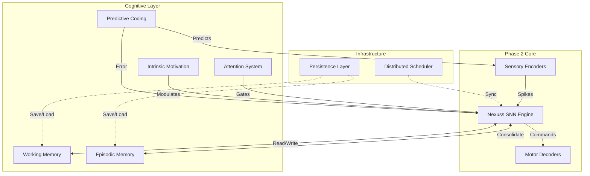

# Phase 3 Specification: Autonomous Cognitive Architecture

**Project:** Nexuss Neural Cognition  
**Phase:** 3 of 3  
**Status:** DRAFT SPECIFICATION  
**Version:** 3.0.0-alpha  

---

## 1. Executive Summary

Phase 3 culminates the Nexuss Neural Cognition project by implementing **higher-order cognitive functions** atop the embodied sensorimotor substrate established in Phase 2. This phase introduces multi-scale memory systems, attention mechanisms, intrinsic motivation, and predictive coding, transforming the reactive agent into an **autonomous cognitive entity** capable of goal-directed behavior, adaptation, and self-improvement.

The system will transition from simple stimulus-response learning to **model-based reasoning**, enabling long-term planning, context-aware decision making, and open-ended exploration driven by internal drives.

---

## 2. Scope & Objectives

### 2.1 In Scope
- **Multi-Scale Memory Systems:** Working memory, episodic (hippocampal) memory, and consolidation.
- **Attention & Salience:** Mechanisms for focusing resources on relevant stimuli.
- **Intrinsic Motivation:** Homeostatic drives and curiosity-based exploration.
- **Predictive Coding:** Top-down expectation generation and error-driven learning.
- **Distributed Simulation:** Multi-node support for scaling beyond single-machine RAM.
- **Persistence:** Saving/loading network states and memory traces.

### 2.2 Out of Scope
- General Artificial Intelligence (AGI) - this is a specialized cognitive architecture.
- Natural Language Processing (NLP) - reserved for future integration.
- Cloud-based training pipelines.

### 2.3 Key Performance Indicators (KPIs)
| Metric | Target | Measurement Method |
| :--- | :--- | :--- |
| **Memory Recall Latency** | < 50ms | Time from cue to retrieval |
| **Attention Switching** | < 10ms | Time to reallocate focus |
| **Prediction Accuracy** | > 80% | Match between predicted/actual sensory input |
| **Task Solving** | Solve 3-step novel tasks | Success rate in maze/manipulation tasks |
| **Scalability** | 1M+ neurons across nodes | Strong scaling efficiency |

---

## 3. Technical Architecture

### 3.1 System Diagram



### 3.2 Module Specifications

#### 3.2.1 Working Memory (Prefrontal Cortex Model)
- **Function:** Temporary retention of task-relevant information (seconds to minutes).
- **Implementation:** 
  - Recurrent neural clusters with sustained activity via attractor dynamics.
  - Capacity limit: 7 ± 2 items (slots).
  - Decay mechanism: Activity fades without rehearsal.
- **Interface:** `working_memory.h` - `push()`, `pop()`, `rehearse()`.

#### 3.2.2 Episodic Memory (Hippocampal Model)
- **Function:** Long-term storage of specific events (context, time, place).
- **Implementation:**
  - Sparse distributed representations (SDR).
  - Spike-Timing Compression: Compress temporal sequences into spatial patterns.
  - Consolidation: Offline replay during "sleep" cycles to transfer to structural weights.
- **Interface:** `episodic_memory.h` - `encode_event()`, `retrieve_context()`, `replay()`.

#### 3.2.3 Attention & Salience System
- **Function:** Prioritize sensory inputs and internal states for processing.
- **Implementation:**
  - **Bottom-Up:** Saliency map based on novelty/intensity (e.g., sudden motion).
  - **Top-Down:** Goal-directed bias (e.g., "look for red objects").
  - **Mechanism:** Multiplicative gain on input spikes to attended regions.
- **Interface:** `attention.h` - `set_focus(region)`, `compute_saliency()`.

#### 3.2.4 Intrinsic Motivation & Homeostasis
- **Function:** Generate internal goals to drive exploration and learning.
- **Implementation:**
  - **Homeostatic Drives:** Energy level, safety margin, social proximity (simulated).
  - **Curiosity Drive:** Maximize learning progress (minimize prediction error).
  - **Reward Signal:** Composite function of drive reduction + curiosity satisfaction.
- **Interface:** `motivation.h` - `update_drives()`, `generate_goal()`.

#### 3.2.5 Predictive Coding Framework
- **Function:** Anticipate future sensory inputs to guide perception and action.
- **Implementation:**
  - **Generative Model:** Top-down connections predict next sensory state.
  - **Prediction Error:** Difference between prediction and actual input drives learning.
  - **Active Inference:** Select actions that minimize expected prediction error.
- **Interface:** `predictive_coding.h` - `predict()`, `compute_error()`, `infer_action()`.

#### 3.2.6 Distributed Simulation Engine
- **Function:** Scale network across multiple machines/nodes.
- **Implementation:**
  - **MPI Integration:** Message Passing Interface for spike exchange.
  - **Domain Decomposition:** Split neurons/synapses across nodes.
  - **Synchronization:** Barrier sync at each time step (or async with delay).
- **Interface:** `distributed.h` - `init_mpi()`, `exchange_spikes()`, `sync_state()`.

#### 3.2.7 Persistence Layer
- **Function:** Save/load network state, memory traces, and learned weights.
- **Implementation:**
  - **Binary Serialization:** HDF5 format for large arrays.
  - **Checkpointing:** Periodic auto-save during operation.
  - **Versioning:** Schema versioning for backward compatibility.
- **Interface:** `persistence.h` - `save_checkpoint()`, `load_checkpoint()`.

---

## 4. Implementation Plan

### 4.1 Milestone 1: Memory Systems (Weeks 1-6)
- **Goal:** Implement Working and Episodic Memory.
- **Deliverables:**
  - `WorkingMemory` class with attractor dynamics.
  - `EpisodicMemory` class with SDR encoding.
  - Consolidation algorithm (offline replay).
- **Acceptance Test:** Robot remembers location of object after 5-minute delay.

### 4.2 Milestone 2: Attention & Motivation (Weeks 7-10)
- **Goal:** Implement attention gating and intrinsic drives.
- **Deliverables:**
  - `AttentionSystem` with saliency maps.
  - `MotivationEngine` with homeostatic variables.
  - Integration with STDP reward gating.
- **Acceptance Test:** Robot prioritizes novel objects over familiar ones; seeks "charging station" when energy low.

### 4.3 Milestone 3: Predictive Coding (Weeks 11-14)
- **Goal:** Implement top-down prediction and error-driven learning.
- **Deliverables:**
  - `PredictiveCoder` class with generative model.
  - Prediction error calculation module.
  - Active inference loop for action selection.
- **Acceptance Test:** Robot anticipates object trajectory and intercepts it; adapts to changed environment dynamics faster than Phase 2.

### 4.4 Milestone 4: Distribution & Persistence (Weeks 15-18)
- **Goal:** Enable multi-node scaling and state persistence.
- **Deliverables:**
  - MPI integration for distributed spiking.
  - HDF5 checkpoint save/load.
  - Scaling benchmarks (2, 4, 8 nodes).
- **Acceptance Test:** 1M neuron simulation runs across 4 nodes; system resumes exactly from checkpoint after restart.

### 4.5 Milestone 5: Integrated Demonstration (Weeks 19-22)
- **Goal:** Full system demo of autonomous cognition.
- **Deliverables:**
  - Complex task scenario (e.g., "Find key, unlock door, retrieve item").
  - Final performance report.
  - Academic paper draft.
- **Acceptance Test:** Robot completes multi-step task autonomously using memory, attention, and planning without explicit scripting.

---

## 5. Interface Contracts

### 5.1 Internal API (C++ Headers)
```cpp
// Working Memory
class WorkingMemory {
public:
    void push(const SpikePattern& pattern);
    SpikePattern recall(const Context& cue);
    void rehearse(); // Prevent decay
};

// Episodic Memory
class EpisodicMemory {
public:
    void encode_event(const Event& e);
    std::vector<Event> retrieve_by_context(const Context& c);
    void consolidate(); // Offline replay
};

// Motivation
struct DriveState {
    float energy;
    float safety;
    float curiosity;
};
class MotivationEngine {
public:
    DriveState get_state();
    Goal generate_goal();
    float compute_reward(const State& s);
};
```

### 5.2 Configuration File (`phase3_config.yaml`)
```yaml
memory:
  working_capacity: 7
  episodic_max_events: 10000
  consolidation_interval_sec: 300

attention:
  saliency_threshold: 0.7
  top_down_gain: 2.0

motivation:
  drives:
    energy: { initial: 1.0, decay_rate: 0.001 }
    curiosity: { initial: 0.5, decay_rate: 0.0 }
    
predictive_coding:
  prediction_horizon_ms: 500
  learning_rate: 0.005

distributed:
  enabled: true
  mpi_rank_file: "hosts.txt"
  
persistence:
  checkpoint_interval_min: 10
  save_dir: "/data/checkpoints"
```

---

## 6. Risk Management

| Risk | Probability | Impact | Mitigation Strategy |
| :--- | :--- | :--- | :--- |
| **Memory Interference** | High | Medium | Implement distinct encoding contexts; use sparse representations. |
| **Convergence Failure** | Medium | High | Add stability constraints to predictive coding; monitor error divergence. |
| **MPI Overhead** | Medium | High | Optimize spike packing; use asynchronous communication where possible. |
| **Complexity Explosion** | High | High | Modular design; rigorous unit testing per component; phased integration. |

---

## 7. Deliverables Checklist

- [ ] `src/memory/working_memory.cpp`
- [ ] `src/memory/episodic_memory.cpp`
- [ ] `src/cognition/attention_system.cpp`
- [ ] `src/cognition/motivation_engine.cpp`
- [ ] `src/cognition/predictive_coding.cpp`
- [ ] `src/distributed/mpi_wrapper.cpp`
- [ ] `src/io/persistence_hdf5.cpp`
- [ ] `config/phase3_params.yaml`
- [ ] Multi-node Docker Compose file
- [ ] Unit Tests for all cognitive modules
- [ ] Integration Scenario Scripts
- [ ] Phase 3 Final Report & Paper Draft

---

## 8. Sign-Off Criteria

Phase 3 is considered complete when:
1.  **Memory Demo:** Robot successfully performs delayed match-to-sample task.
2.  **Motivation Demo:** Robot exhibits self-sustaining exploration and resource-seeking behavior.
3.  **Prediction Demo:** Robot anticipates and reacts to dynamic changes before they fully occur.
4.  **Scale Demo:** 1M+ neuron network runs stably across ≥4 nodes.
5.  **Integration Demo:** End-to-end autonomous completion of a novel 3-step task.
6.  Code is merged to `main` with >90% test coverage and full API documentation.

---

## 9. Future Work (Post-Phase 3)
- **Language Integration:** Connect to LLMs for symbolic reasoning.
- **Social Cognition:** Multi-agent interaction and theory of mind.
- **Neuromorphic Hardware:** Deploy to Loihi/SpiNNaker for ultra-low power.
- **Lifelong Learning:** Continuous adaptation without catastrophic forgetting.

**Approved By:** ____________________  
**Date:** ____________________
